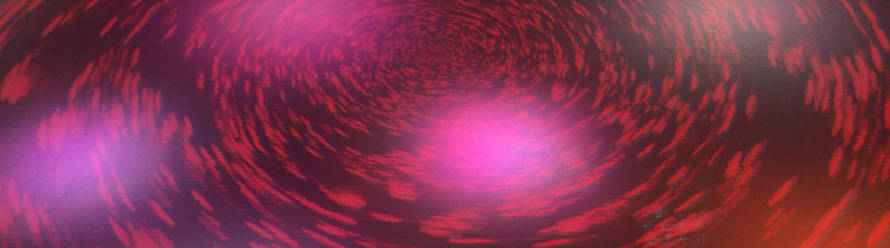

 

[](https://github.com/NERDDISCO/luminave/releases/tag/3.0.0)

Use luminave to manage all the lights with your web browser and create stunning visual experiences.

* *lumi* = "Light" in different languages
* *nave* = "A hub of a wheel"


[](https://lit-element.polymer-project.org/)
[](https://www.polymer-project.org/)
[](https://github.com/Polymer/pwa-starter-kit "Built with pwa–starter–kit")
[](https://github.com/PolymerX/polymerx-cli)
[](https://redux.js.org/)
[](https://developer.mozilla.org/en-US/docs/Web/JavaScript/Reference/Statements/import)
[](https://wicg.github.io/webusb/)
[](https://webaudio.github.io/web-midi-api/)
[](https://developer.mozilla.org/en-US/docs/Web/API/WebSocket)
[](https://developer.mozilla.org/en-US/docs/Web/API/Window/localStorage)

---

[](http://www.youtube.com/watch?v=GiTkwz9AKhM "modV + luminave in ❤️ with Chiptune")

_Video of modV + luminave in ❤️ with Chiptune (Caution: Flashing lights & music!)_


---

[](http://www.youtube.com/watch?v=GiTkwz9AKhM "modV + luminave in ❤️ with Chiptune")

_Video of modV + luminave in ❤️ with Chiptune (Caution: Flashing lights & music!)_

---
<!-- toc -->
- [Getting started](#getting-started)
  - [Requirements](#requirements)
  - [Setup](#setup)
  - [Run](#run)
- [Features](#features)
- [Integrations](#integrations)
  - [WebUSB DMX512 Controller](#webusb-dmx512-controller)
  - [modV](#modv)
    - [In luminave](#in-luminave)
    - [In modV 1.0](#in-modv-10)
    - [In modV 2.0](#in-modv-20)
  - [Thorium](#thorium)
  - [Dekk](#dekk)
    - [In luminave](#in-luminave-1)
    - [In dekk](#in-dekk)
  - [fivetwelve](#fivetwelve)
- [Contribution](#contribution)
  - [Contributors](#contributors)
- [Thanks to](#thanks-to)

<!-- tocstop -->

---

# Getting started

## Requirements

* Browser Chrome 61+ (to support other browsers [see #41](https://github.com/NERDDISCO/luminave/issues/41))
* npm ([How to install](https://nodejs.org/en/download/package-manager/))

## Setup

```bash
# clone luminave
git clone git@github.com:NERDDISCO/luminave.git

# go into directory
cd luminave

# install dependencies
yarn
# or
npm install

# install polymer-cli which is used to run luminave
npm install -g polymer-cli
```

## Run

Start the local HTTPS server on http://localhost:8081:

```bash
yarn start
# or
npm start
```

---

# Features

* Handle one DMX512 universe
* Add fixtures of different types (using the [DmxDevice](https://github.com/beyondscreen/fivetwelve/blob/master/lib/device/DmxDevice.js) implementation of [fivetwelve](https://github.com/beyondscreen/fivetwelve)) to have an abstraction of the fixture and to be able to use properties instead of setting the values on the channels itself. So for example you can set the `color` property, which accepts an RGB value as `[255, 0, 125]` and fivetwelve knows how to split that into the corresponding channels
* You can change the properties of a fixture with various input fields depending on which property you want to change
* Add animations, which can contain a variable amount of keyframes. Each keyframe can have a variable amount of fixture properties. In terms of code this looks like this:
```json
{
    "0": {
      "color": [255, 0, 0],
      "dimmer": 255
    },
    "1": {
      "color": [0, 0, 50],
      "dimmer": 120
    }
}
```
* The animation itself has no idea about time, it always goes from 0 to 1. You can add as many steps inbetween as you want
* Scenes are the way to go to bring fixtures and animations together
* Connect a MIDI controller via USB to your computer and add it as a MIDI controller into luminave. With "MIDI learn" you can push a button on your MIDI controller and luminave saves the corresponding note into it's config, so you don't have to manually find out what note is on with button
* Add scenes to MIDI controller buttons to activate them when the MIDI button is pushed
* When a scene is active it is added to the timeline. The timeline handles all scenes and can be started / stopped
* Connect to a USB DMX controller that implements the WebUSB specification
* Connect to a modV WebSocket bridge to get colors from modV instead of setting the colors yourself
* Connect to a fivetwelve WebSocket bridge to send your universe to a DMX controller that is controlled by fivetwelve

---

# Integrations

## WebUSB DMX512 Controller

* Connect your Arduino to the computer via USB
* Click the "USB" button in the top left in luminave
* Choose the "Arduino" in the browser dialog

[Do you want to create your own WebUSB DMX512 Controller?](https://github.com/NERDDISCO/webusb-dmx512-controller)


## modV

If you want to use modV you have to start the local WebSocket server:

### In luminave

* Start the server with `npm run modv-integration`
* Click the "connect" button of the modV component in the luminave UI

### In modV 1.0

* Drop the "grabCanvas" component into the list of modules
* This should connect to the local WebSocket server on localhost:3000


### In modV 2.0

* Activate the "grab-canvas" plugin
* Set the amounts of areas you want to grab


## Thorium

Take a look at the [Thorium docs](docs/Thorium.md). 


## Dekk

If you want to use [Dekk](https://github.com/sinnerschrader/dekk) you have to start the local WebSocket server too:

### In luminave

* Start the server with `npm run dekk-integration`
* Click the "connect" button of the dekk component in the luminave UI

### In dekk

* Connect to the WebSocket server on localhost:3001


## fivetwelve

If you want to use [fivetwelve](https://github.com/beyondscreen/fivetwelve):

* Download and install [fivetwelve-bridge](https://github.com/usefulthink/fivetwelve-bridge/)
* Start the WebSocket server provided by fivetwelve-bridge with `npm start`
* In luminave: Click the "connect" button of the fivetwelve component

When you start the timeline all data is also send to fivetwelve.

---


# Contribution

Please read the [Contribution guideline](.github/CONTRIBUTING.md). 

##  Contributors

* [Gregor Adams](https://github.com/pixelass)
* [Kevin Gimbel](https://github.com/kevingimbel)


---


# Thanks to

* [Gregor Adams](https://github.com/pixelass) for working with me on luminave, hours and hours of pair-programming and knowledge transfer, partner in debugging the most ugly performance problems and everything else ❤️
* [Martin Schuhfuss](https://github.com/usefulthink) for fivetwelve and a lot of DMX512 knowledge ❤️
* [Sam Wray](https://github.com/2xaa) for creating [modV](https://github.com/2xAA/modV) and helping me to integrate modV into everything related to NERD DISCO ❤️
