# Thorium + luminave

If you want to use [Thorium](https://github.com/Thorium-Sim) as your space ship simulator and control the lights using luminave, you come to the right place. 

<!-- toc -->

- [Thorium + luminave](#thorium--luminave)
  - [How does it work?](#how-does-it-work)
  - [Setup](#setup)
  - [Config](#config)
  - [Usage](#usage)
    - [Thorium](#thorium)
      - [Use the lighting controls](#use-the-lighting-controls)
        - [Color](#color)
        - [Alert Level](#alert-level)
        - [Mode / Action](#mode--action)
    - [luminave](#luminave)
      - [Add a new universe](#add-a-new-universe)
      - [Add lights (fixtures)](#add-lights-fixtures)
        - [Type](#type)
        - [Address](#address)
        - [Name](#name)
        - [Amount](#amount)
      - [Test lights (fixtures)](#test-lights-fixtures)
      - [Add scenes](#add-scenes)
        - [Add animation & fixture to scene](#add-animation--fixture-to-scene)
      - [Start the timeline](#start-the-timeline)
      - [Connection to luminave-server](#connection-to-luminave-server)
      - [Connection to luminave-fivetwelve](#connection-to-luminave-fivetwelve)
        - [Supported USB DMX512 controllers](#supported-usb-dmx512-controllers)
  - [Lighting scenarios](#lighting-scenarios)
    - [One light can only display one color](#one-light-can-only-display-one-color)
    - [RGB lights that can display every color](#rgb-lights-that-can-display-every-color)
  - [FAQ](#faq)
    - [I have no idea which fixture type to choose](#i-have-no-idea-which-fixture-type-to-choose)
    - [No data received from Thorium](#no-data-received-from-thorium)
    - [I have multiple Thorium server running and luminave-thorium is connecting to a random server](#i-have-multiple-thorium-server-running-and-luminave-thorium-is-connecting-to-a-random-server)

<!-- tocstop -->

## How does it work?

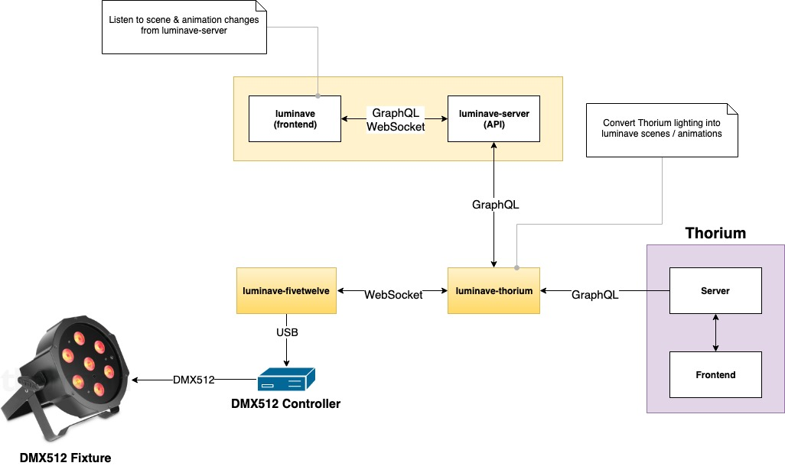

* Thorium is providing a GraphQL API and whenever the lighting is changing, the `simulator.lighting` gets updated
* [luminave-thorium](https://github.com/NERDDISCO/luminave-thorium) is listening for these changes and converts the lighting into a format that [luminave](https://github.com/NERDDISCO/luminave) understands
* [luminave-server](https://github.com/NERDDISCO/luminave-server) is providing a GraphQL API that is used by [luminave-thorium](https://github.com/NERDDISCO/luminave-thorium) to send the lighting data to 
* [luminave](https://github.com/NERDDISCO/luminave) itself is connected to [luminave-server](https://github.com/NERDDISCO/luminave-server) and whenever a scene or animation is added via the API of [luminave-server](https://github.com/NERDDISCO/luminave-server), it updates the timeline of [luminave](https://github.com/NERDDISCO/luminave)
* The DMX512 controller is handled by [luminave-fivetwelve](https://github.com/NERDDISCO/luminave-fivetwelve) from within [luminave](https://github.com/NERDDISCO/luminave)

This way you can control all the DMX512 lights from within Thorium. 


## Setup

Clone the following repos:

* [luminave](https://github.com/NERDDISCO/luminave)
* [luminave-server](https://github.com/NERDDISCO/luminave-server)
* [luminave-thorium](https://github.com/NERDDISCO/luminave-thorium)
* [luminave-fivetwelve](https://github.com/NERDDISCO/luminave-fivetwelve)

Go into each each folder and execute `npm install`

## Config

* [luminave](https://github.com/NERDDISCO/luminave) can be configured using the UI at [localhost:8081](http://localhost:8081/)
* [luminave-thorium](https://github.com/NERDDISCO/luminave-thorium), [luminave-server](https://github.com/NERDDISCO/luminave-server) & [luminave-fivetwelve](https://github.com/NERDDISCO/luminave-fivetwelve) can be configured by creating an `.env` file in each folder. 


## Usage

Start each application by executing `npm start` in each folder:

* luminave
* luminave-server
* luminave-thorium
  * Thorium should be started first, otherwise luminave-thorium can't find it automatically
  * If you don't want to have this behavior, you can configure the IP + port in luminave-thorium manually
* luminave-fivetwelve


### Thorium

When luminave-thorium is started, it starts to search for Thorium on the network and connects to the first one it finds automatically. 

In the "Flight Lobby" you have to add the client `ECS-luminave-thorium` to your flight & select the simulator. 

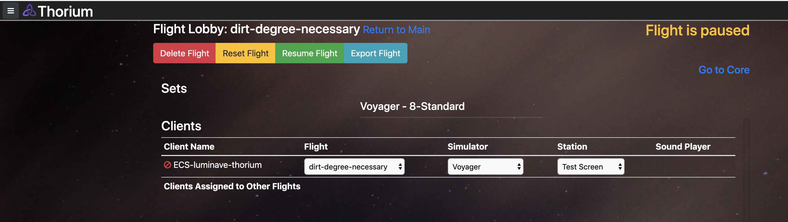

Once this is done you can open the core and see the new lighting controls

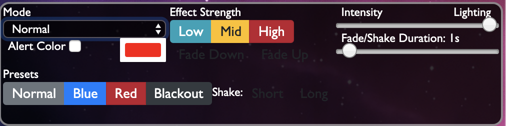

Now you can change everything to trigger different effects in your simulator.


#### Use the lighting controls

The following information about each part of the lighting controls is taken [from a description by Alex Anderson](https://github.com/Thorium-Sim/thorium/issues/1645). 

##### Color

color is a suggestion for what color the lights should be. This doesn't mean all the lights need to be this color, but they can be.

The default preset allows 4 different colors:

* normal
* red
* blue
* black (Thorium >= 1.22.0)

These keywords can be used in luminave to control the lights that should react for one of these colors. See [Lighting scenarios](#lighting-scenarios) for more. 

You can also create any custom color you want, but then you have to take care of how that can be mapped in luminave. 

##### Alert Level

In Thorium you can activate the checkbox `Alert Color` to change the current color based on the alert levels (1 to 5 & P). When this is activated, the Color preset will not be used anymore, but one of the 6 alerts:

* Alert 1 (= `alert-1`)
* Alert 2 (= `alert-2`)
* Alert 3 (= `alert-3`)
* Alert 4 (= `alert-4`)
* Alert 5 (= `alert-5`)
* Alert P (= `alert-p`)


##### Mode / Action

The lighting control software should take the mode (or action) and perform whatever function is necessary for the action. 

If the action is **shake**, it should apply random intensities to the lights so they shake (as in an explosion). However, if intensity is set to 0.5, it should multiply the random intensity by that value so it is a darker shake. `actionStrength` would make the shake more or less intense. So if `actionStrength` is 1, it would be a crazy-powerful shake. If it was at 0.1, it would be hardly a flicker.

**Strobe** should flash the lights on and off, with the `actionStrength` making the strobe faster or slower.

**Oscillate** should make the lights fade in and out continuously. `actionStrength` works the same way as it does with the "Shake" action.

**Fade** makes it so changing the intensity does a linear interpolation over the `transitionDuration` time.

One thing which Thorium does automatically - if the 'Shake Long' or 'Shake Short' buttons are pressed or if the "Fade Up" or "Fade Down" buttons are pressed, it will automatically switch the action back to 'normal' after the `transitionDuration`.

---

### luminave

The main UI to control the lighting is provided in luminave, which can be accessed using a browser (only tested with Google Chrome): [localhost:8081](http://localhost:8081/).

#### Add a new universe

A universe handles the data of a network of lights. Each value in the universe represents a channel of a light (also called fixture). 

* Open the "universe" tab
* Click on the "add universe" button

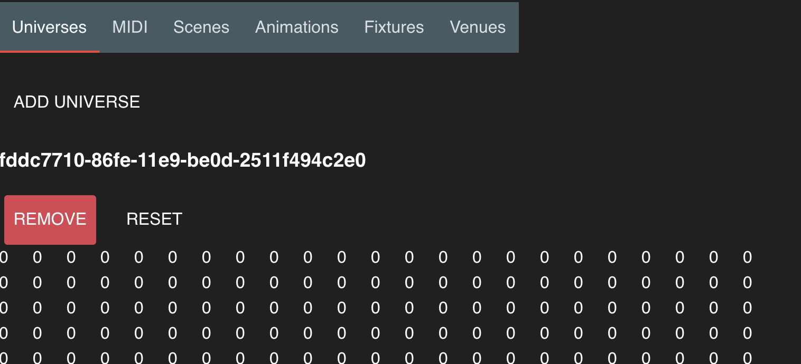

Once this is done, we don't need to do anything with the universe again. As of now luminave only supports one universe and will only use the first one in the list. So adding another one has no effect at all

---

#### Add lights (fixtures)

A light (also called fixture) can be added using the `Fixtures` tab. 

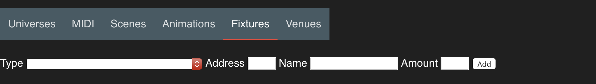

##### Type

`type` is the fixture model. Every model has different kind of channels with different functionality. There are some basic ones that can be used prefixed with `Basic`
  * **BasicDimmer**
    1. Channel: Dimmer
  * **BasicColor**
    1. Channel: Red
    2. Channel: Green
    3. Channel: Blue
  * **BasicRGBDimmer**
    1. Channel: Red
    2. Channel: Green
    3. Channel: Blue
    4. Channel: Dimmer
  * **BasicFluter**
    1. Channel: Red
    2. Channel: Green
    3. Channel: Blue
    4. Channel: White
    5. Channel: Dimmer
    6. Channel: Strobe
  * **BasicRGBW**
    1. Channel: Red
    2. Channel: Green
    3. Channel: Blue
    4. Channel: White

If you have no idea which `type` to choose, please open an [issue on luminave](https://github.com/NERDDISCO/luminave/issues)! 


##### Address

Each fixture inside a universe gets a specific address, so that you can control them individually. The adress gets configured on the fixture itself (via jumper or a display) and needs to be configured in luminave too, so that luminave can control the fixture. 

##### Name

You can give the fixture a name so that you know which fixtures you are dealing with. When you have a lighting plan of your simulator, you can name the lights in there, write the name also on the fixture itself and use the same name in luminave. That way you will always find the fixture that you are looking for, especially if something is not working. 

##### Amount

This is optional and should only be used if you want to add multiple fixtures of the same type. The address of every fixture added will increase by the amount of channels of the type you have choosen. So when you use the `BasicColor` fixture on address 1 with an amount of 3 with the name `my-fixture` you will get something like this:

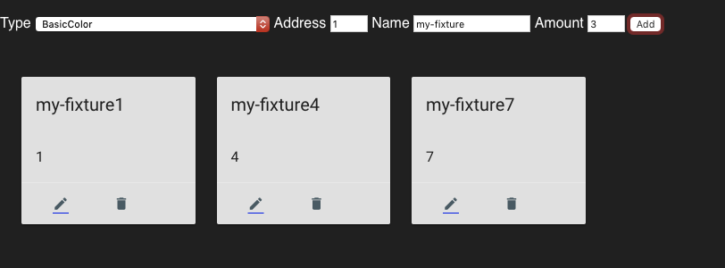


#### Test lights (fixtures)

When you have added a fixture, you can edit it by clicking on the `edit` button. There you can see all the different properties and when you change one of these (and the timeline is NOT running), it will send the changed values directly to the fixture. This way you can make sure that everything is setup correctly. 

---

#### Add scenes

A scene combines fixtures and animations with each other, meaning that when a scene is running in the timeline, all animations are applied to the fixtures. 

You can add new scenes using the `Scenes` tab:

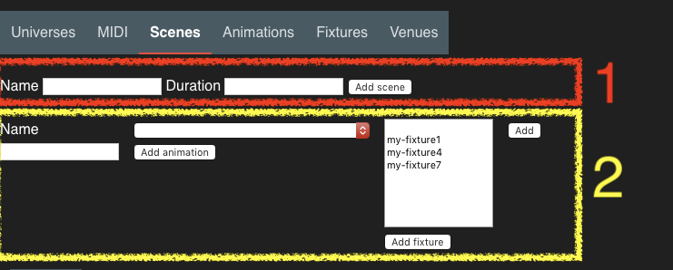

There are two ways to add a scene:

1. By specifing the `name` and the `duration` (in milliseconds)
2. By specifing the `name`, the `animation` that should be attached and the `fixtures` that should be used

The 2. way makes sense if you already have an `animation` and `fixture` configured, so you don't have to add them manually after the scene was created. 

##### Add animation & fixture to scene

* Find the scene you want to change
* The first dropdown is a list of all animations. Select the animation you want to add and click on the `Add animation` button. The animation will show up underneath the dropdown
* Then there is a list of fixtures undearneath. Select the fixtures you want to add and click on the `Add fixture` button. The fixtures will show up underneath the list

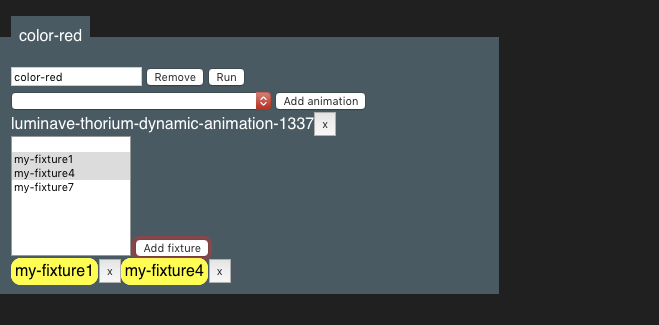


#### Start the timeline

When everything is configured and you want the scenes to run (= the lights will light up), you have to click the `Play` button in the top right. The `Play` button is part of the `timeline`. It handles all scenes. 

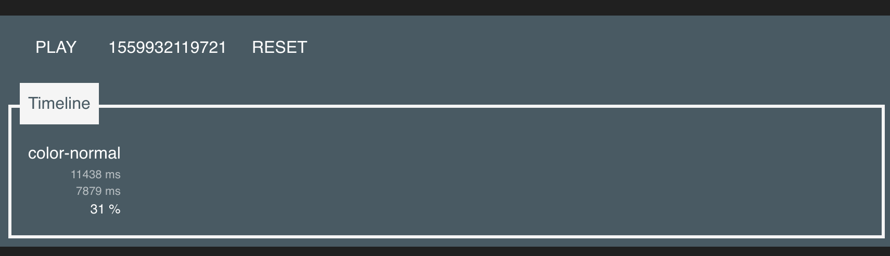

---

#### Connection to luminave-server

In order to exchange data with Thorium, luminave needs a connection to luminave-server. This can be established & configured using the right panel:

* Open the right panel using the menu-icon in the top right
  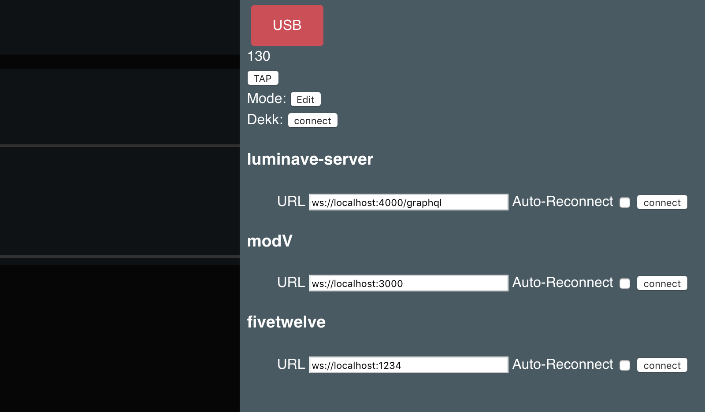
* Find the [luminave-server](https://github.com/NERDDISCO/luminave-server) headline
* There you can see the connection-status (an emoji), the URL of luminave-server, the auto-reconnect checkbox and the connect button
* The default URL of luminave-server is `ws://localhost:4000/graphql` 
  * (if you want to change that, you have to change the configuration of luminave-server and then update the URL in luminave too)
* It's recommended to check the auto-reconnect checkbox, so that whenever the connection is lost, luminave will try to establish it again. It will also try to reconnect when luminave is reloaded
  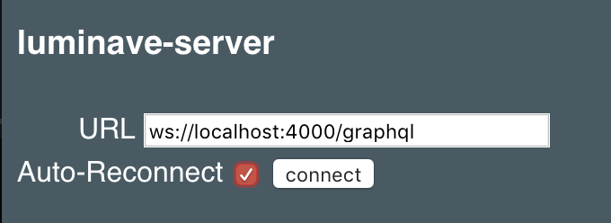
* Click the "connect" button
* The connection-status should change to a ❤️
  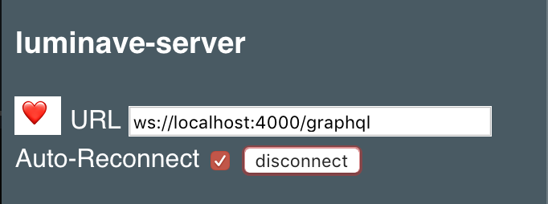
* If there is a problem, you will see a 💀
  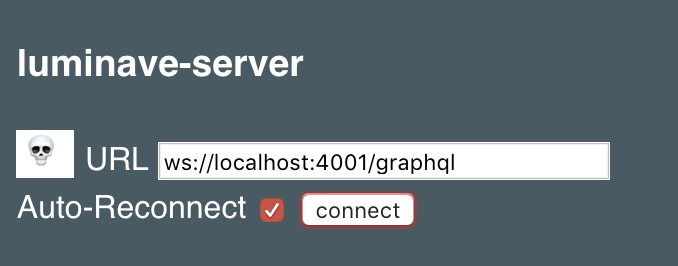


---
  
#### Connection to luminave-fivetwelve

In order to send lighting information via DMX512 to a USB DMX512 controller, luminave needs a connection to luminave-fivetwelve. 

* Follow the same steps as for luminave-server, but search for the **fivetwelve** headline
* The default URL of luminave-fivetwelve is `ws://localhost:1234`


##### Supported USB DMX512 controllers

As of know the only supported controllers are

* Enttec USB Pro
* Enttec USB Pro mk2


--- 

## Lighting scenarios

### One light can only display one color

In one simulator there are three different types of light. These lights can only display one color. When ever Thorium sends a color, we have to know which light should be turned on:

* Create a scene for every light using the following naming schema (When ever there is a color change in Thorium, luminave will know based on the naming schema which light should be turned on / off. So the scenes have to be named like this):
  * `color-normal` for what ever the usual light situation is
  * `color-blue` for blue lights
  * `color-red` for red lights
* Add the animation `luminave-thorium-dynamic-animation-1337` to each scene (it is added automatically if you have setup the connection to luminave-server already and luminave-thorium is also running). If you can't find this, then you can also do this later when all the required modules are running, see [Usage](#usage)
* Create the fixtures that represent the lights using the `BasicDimmer` type
* Add the fixtures to the corresponding scene
  * All blue fixtures will go into `color-blue`
  * All red fixtures will go into `color-red`
  * Every other fixture (maybe white?) will go into `color-normal` 

If you want to use a custom color from the color picker, make sure to create scenes that are named like `color-#hexcolorcode`. For example if you would pick the color `#991BCD` your scene would be named `color-#991bcd` (every letter has to be lowercase). 

Your scenes will now look like this:

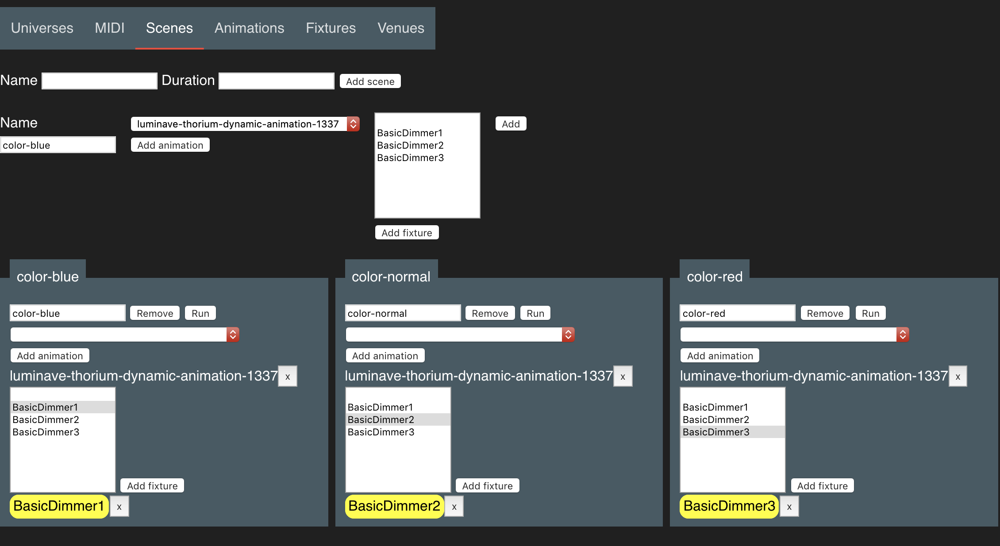

Now you can start the timeline and make your changes in Thorium and everything should work. 


### RGB lights that can display every color

In simulators with RGB compatible lights we can display any color. 

* Create a scene for all the lights
* Create all fixtures using the `BasicRGBDimmer` type
* Add the animation `luminave-thorium-dynamic-animation-1337` to each scene (it is added automatically if you have setup the connection to luminave-server already and luminave-thorium is also running). If you can't find this, then you can also do this later when all the required modules are running, see [Usage](#usage)
* Add all fixtures to that scene

Now you can start the timeline and make your changes in Thorium and everything should work. 

---

## FAQ

### I have no idea which fixture type to choose

If you have no idea which type to choose, open an [issue on luminave](https://github.com/NERDDISCO/luminave/issues) and put the exact manufacturer + name of the fixture into it. Then we will try our best to add the missing fixture to luminave.


### No data received from Thorium

Check if the client IP changed, if that happened you have to restart Thorium & luminave-thorium so it registers itself with the new IP of your computer


### I have multiple Thorium server running and luminave-thorium is connecting to a random server

You have to configure the IP of the Thorium server you want connect to by creating an `.env` file in luminave-thorium. The file would look like this

```bash
# Host of Thorium
HOST_THORIUM=192.168.41.1

# Port of Thorium
PORT_THORIUM=1337
```

This will deactivate the auto-connection to the nearest Thorium server and use the configured host instead. 
