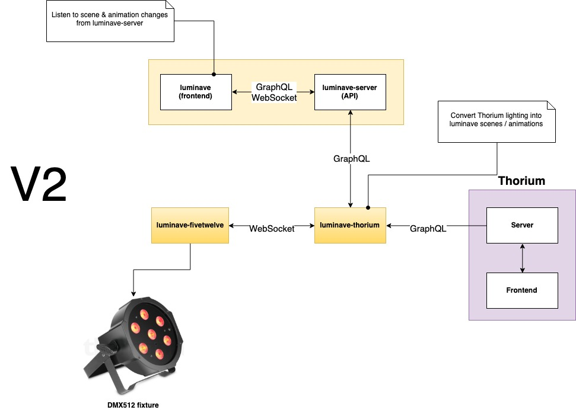

# Thorium

If you want to use [Thorium](https://github.com/Thorium-Sim) as your space ship simulator and control the lights using luminave, you come to the right place. 

<!-- toc -->

- [Thorium](#thorium)
  - [How does it work?](#how-does-it-work)
  - [Setup](#setup)
  - [Config](#config)
  - [Usage](#usage)
    - [In luminave](#in-luminave)

<!-- tocstop -->

## How does it work?

* Thorium is providing a GraphQL API and whenever the lighting is changing, the `simulator.lighting` gets updated
* [luminave-thorium](https://github.com/NERDDISCO/luminave-thorium) is listening for these changes and converts the lighting into a format that [luminave](https://github.com/NERDDISCO/luminave) understands
* [luminave-server](https://github.com/NERDDISCO/luminave-server) is providing a GraphQL API that is used by [luminave-thorium](https://github.com/NERDDISCO/luminave-thorium) to send the lighting data to 
* [luminave](https://github.com/NERDDISCO/luminave) itself is connected to [luminave-server](https://github.com/NERDDISCO/luminave-server) and whenever a scene or animation is added via the API of [luminave-server](https://github.com/NERDDISCO/luminave-server), it updates the timeline of [luminave](https://github.com/NERDDISCO/luminave)
* The DMX512 controller is handled by [luminave-fivetwelve](https://github.com/NERDDISCO/luminave-fivetwelve) from within [luminave](https://github.com/NERDDISCO/luminave)

This way you can control all the DMX512 lights from within Thorium. 

## Setup

Clone the following repos:

* [luminave](https://github.com/NERDDISCO/luminave)
* [luminave-server](https://github.com/NERDDISCO/luminave-server)
* [luminave-thorium](https://github.com/NERDDISCO/luminave-thorium)
* [luminave-fivetwelve](https://github.com/NERDDISCO/luminave-fivetwelve)

Go into each each folder and execute `npm install`

## Config

* [luminave](https://github.com/NERDDISCO/luminave) can be configured using the UI at [localhost:8081](http://localhost:8081/)
* [luminave-thorium](https://github.com/NERDDISCO/luminave-thorium), [luminave-server](https://github.com/NERDDISCO/luminave-server) & [luminave-fivetwelve](https://github.com/NERDDISCO/luminave-fivetwelve) can be configured by creating an `.env` file in each folder. YO

## Usage

Start each application by executing `npm start` in each folder:

* luminave
* luminave-server
* luminave-thorium
* luminave-fivetwelve

Then open the luminave frontend in your browser: [localhost:8081](http://localhost:8081/)

### In luminave

* Open the right panel
* See if [luminave-server](https://github.com/NERDDISCO/luminave-server) is connected
